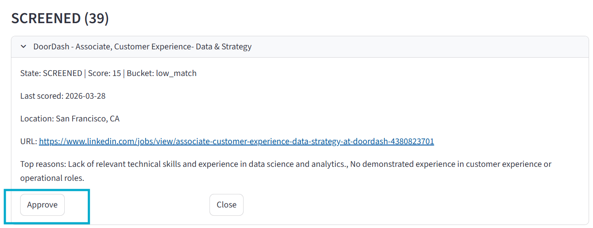
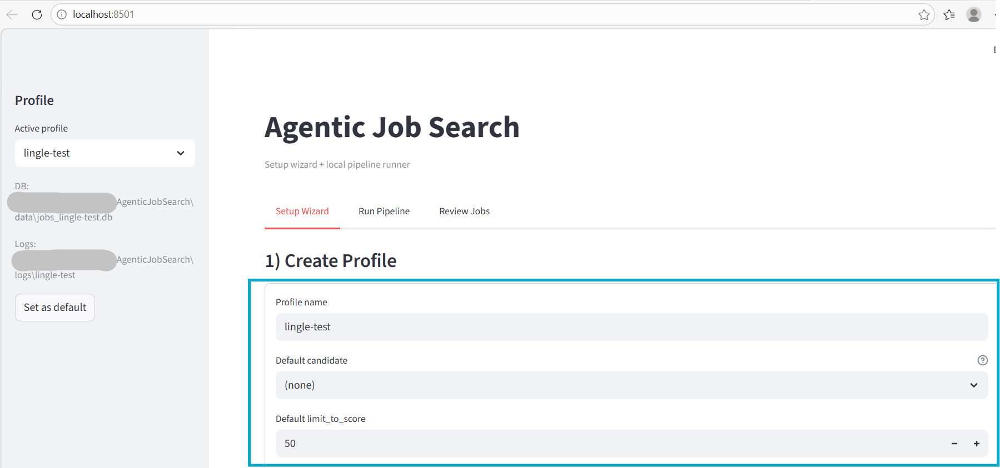
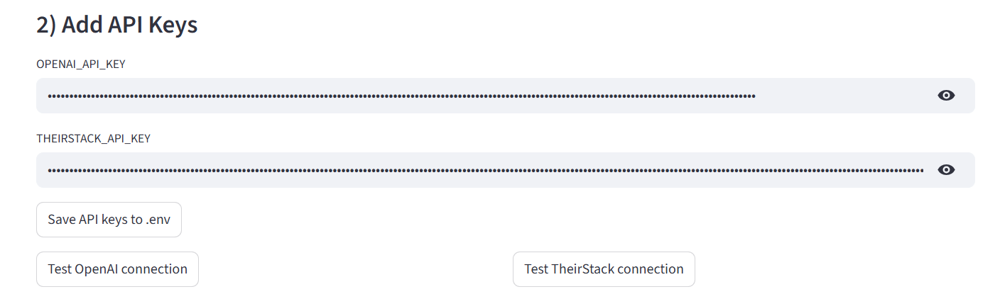
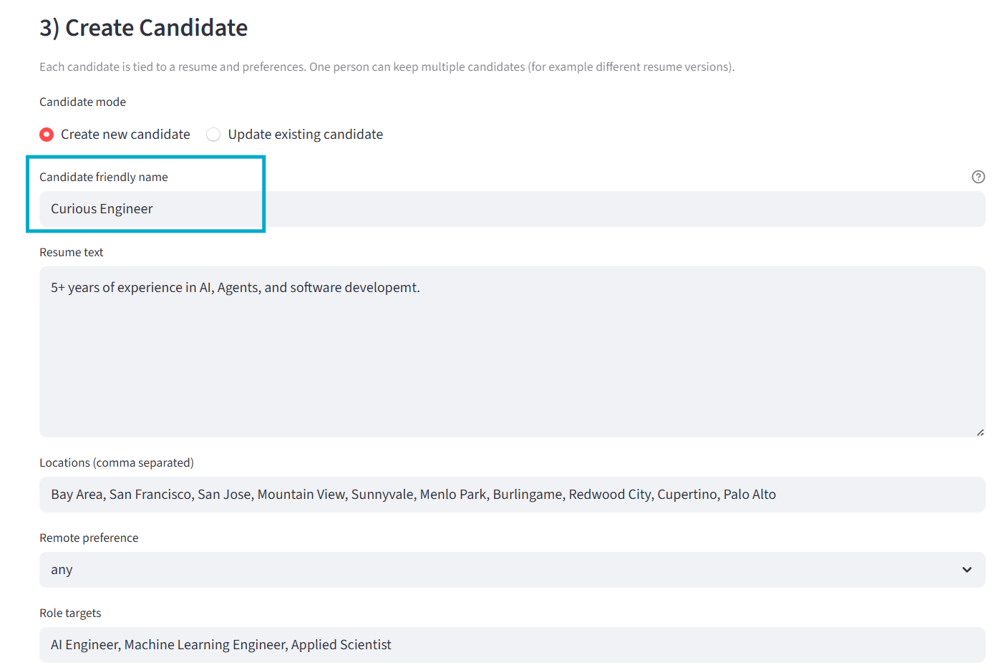
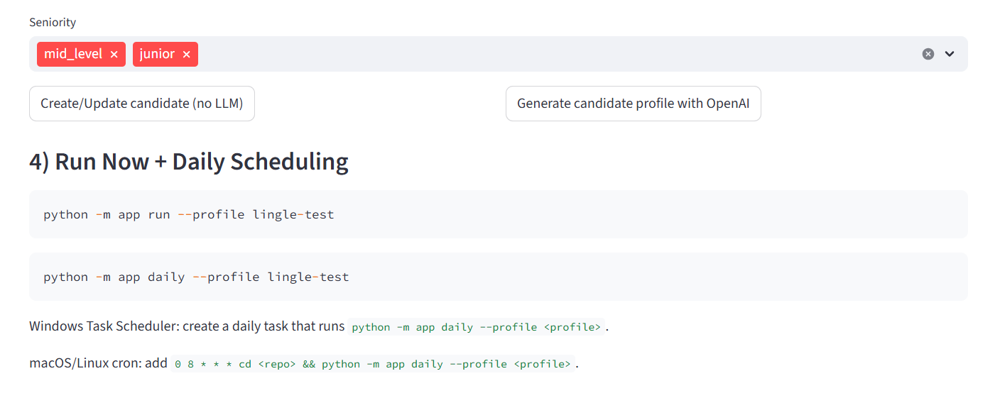
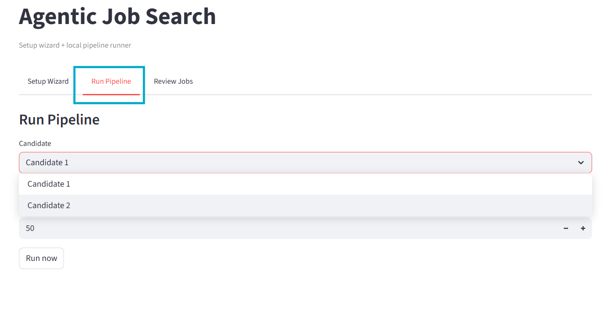

# AIPersonalJobSearch

A local-first agentic job search assistant that automates job discovery, deduplication, LLM-based fit screening, and review workflow tracking.

## LLM Fit Evaluation

The core power of `AIPersonalJobSearch` is not just collecting jobs, but screening them with an LLM against a real candidate profile and stated preferences. This saves applicants time by highlighting relevant jobs, filtering out poor-fit roles before they require a full read, and providing a structured workflow to review each opportunity and act with Approve or Close.

For each promising role, the system can:

- score how well the job fits the candidate on a `1-100` scale
- explain why the role is a good fit
- explain why the role may not be worth pursuing
- persist that reasoning so the user can review, approve, close, or apply with context

This makes the project more than a scraper or tracker. It is a decision-support workflow where the LLM produces direct, reviewable reasoning for each screened job.



## Why I built this

Job search is repetitive operational work: searching across sources, filtering noise, re-reading similar roles, and manually tracking what has already been reviewed or applied to. I built `AIPersonalJobSearch` to turn that workflow into a reproducible local pipeline with persistent state.

This project combines a real retrieval pipeline, deterministic heuristics, optional LLM reasoning, persistent storage, and a human review loop. For users, the goal is a practical assistant that helps surface relevant opportunities without hiding the decision trail.

## Core features

- Local-first workflow with shared SQLite state for candidates, retrieved jobs, fit evaluations, applications, and opportunity states.
- Candidate profile generation from resume text plus structured preferences, with both manual and OpenAI-backed setup paths.
- Provider-based job retrieval, currently implemented for TheirStack.
- Deduplication using strong keys, normalized canonical URLs, and soft keys plus description hashes.
- Heuristic pre-ranking before LLM screening to reduce unnecessary model calls.
- **LLM fit evaluation** Score jobs against the candidate profile and preferences on a `1-100` scale, with explicit reasons to apply and reasons to skip for explainability.
- Review workflow UI that tracks jobs through `DISCOVERED -> SCREENED -> APPROVED -> APPLIED -> CLOSED`.
- Profile-based configuration for multiple candidates, databases, logs, and provider payload overrides.
- CLI and `Makefile` entrypoints for reproducible local runs.

## Example workflow

1. If you are a new user, create a profile first.
2. Inside that profile, create one or more candidates.
3. Create a separate candidate whenever you are targeting a meaningfully different role, using a different resume version, or applying with a different set of preferences.
4. Save API keys and choose the profile you want to run.
5. Run `python -m app run --profile <profile>` or trigger a run from Streamlit.
6. The pipeline pulls jobs for each candidate tied to that profile.
7. Retrieved jobs are normalized, deduplicated, and turned into candidate-specific opportunities.
8. The heuristic pre-ranker scores jobs using keyword overlap, location fit, and dealbreakers.
9. Jobs above the threshold are screened by the LLM if OpenAI is configured; lower-scoring jobs fall back to deterministic scoring.
10. In the review UI, the user approves, closes, or marks applied jobs, and those evaluations remain tied to the specific candidate.

This profile/candidate split is a key design decision in `AIPersonalJobSearch`.

- A profile is the runtime container for configuration such as database path, logs, and provider settings.
- A profile can contain multiple candidates.
- A candidate represents a specific job-search strategy: target role, resume version, preferences, and screening history.
- Jobs are pulled and evaluated per candidate, not just once globally.
- All job evaluations, workflow states, and application history are tied to the candidate.

In practice, that means users benefit from creating separate candidates when they want to pursue very different roles, use different resumes, or maintain different search preferences.

Once your personal workflow is stable, especially your resume version and preference settings, automate the pipeline with cron or Windows Task Scheduler so it runs daily. That is in the candidate's best interest because relevant jobs are often most valuable when found and acted on within 24 hours of posting.

## Demo

The main user-facing workflow lives in the Streamlit app at [agents/orchestrator/streamlit_jobs.py](/c:/Users/yugua/Projects/AgenticJobSearch/agents/orchestrator/streamlit_jobs.py).

It provides three tabs:

- `Setup Wizard`: create profiles, save API keys, create candidates, and configure provider settings.
- `Run Pipeline`: run the retrieval and screening pipeline for a selected candidate.
- `Review Jobs`: inspect screened jobs and move them through the review state machine.

### UI screenshots

Setup flow overview:









Pipeline execution:



Review workflow with status and date tracking:


## Architecture

The system is built as a local pipeline around a shared database and a small set of focused modules:

- `candidate_profile`: stores resume text and preferences, and can generate a structured candidate profile via GPT model.
- `job_search`: pulls jobs from configured providers, normalizes fields, and deduplicates them before persistence.
- `job_match`: computes heuristic retrieval scores, calls an LLM for fit scoring, and stores fit evaluations.
- `orchestrator`: creates opportunities, applies the review state machine, skips recently applied duplicates, and coordinates end-to-end runs.
- `app`: provides the stable CLI entrypoint used by the `Makefile` and the Streamlit runtime.

Operationally, the pipeline works like this:

1. Load a profile from `config/profiles/<name>.json`.
2. Resolve `DB_PATH` and `LOG_DIR` for that profile.
3. Pull N jobs from providers using the perferences config by user. By default N is 50.
4. Normalize and deduplicate jobs into the shared database.
5. Create or update candidate-specific opportunities.
6. Heuristically pre-rank eligible `DISCOVERED` jobs.
7. Run LLM fit screening only for jobs above the retrieval threshold; otherwise use deterministic fallback scoring.
8. Persist fit evaluations and move opportunities into reviewable states.

## Repository structure

Top-level layout:

- [app](/c:/Users/yugua/Projects/AgenticJobSearch/app): CLI entrypoint and shared runtime helpers.
- [agents](/c:/Users/yugua/Projects/AgenticJobSearch/agents): core agent modules and Streamlit apps.
- [config](/c:/Users/yugua/Projects/AgenticJobSearch/config): project-level and profile-level configuration.
- [scripts](/c:/Users/yugua/Projects/AgenticJobSearch/scripts): helper scripts for running the pipeline and tests.
- [tests](/c:/Users/yugua/Projects/AgenticJobSearch/tests): integration coverage.
- [adapters](/c:/Users/yugua/Projects/AgenticJobSearch/adapters): adapter experiments and provider-specific scraping helpers.
- [Makefile](/c:/Users/yugua/Projects/AgenticJobSearch/Makefile): convenience targets for `run`, `daily`, and `test`.

Important implementation files:

- [app/cli.py](/c:/Users/yugua/Projects/AgenticJobSearch/app/cli.py): `python -m app` command parser.
- [app/runtime.py](/c:/Users/yugua/Projects/AgenticJobSearch/app/runtime.py): profile resolution, logging, and pipeline execution wrapper.
- [agents/orchestrator/pipeline.py](/c:/Users/yugua/Projects/AgenticJobSearch/agents/orchestrator/pipeline.py): end-to-end orchestration.
- [agents/job_search/job_search_client.py](/c:/Users/yugua/Projects/AgenticJobSearch/agents/job_search/job_search_client.py): provider client, normalization, and retrieval batch output.
- [agents/job_search/db.py](/c:/Users/yugua/Projects/AgenticJobSearch/agents/job_search/db.py): deduplication and persistence logic for jobs.
- [agents/job_match/agent.py](/c:/Users/yugua/Projects/AgenticJobSearch/agents/job_match/agent.py): heuristic plus optional LLM screening.
- [agents/job_match/state_machine.py](/c:/Users/yugua/Projects/AgenticJobSearch/agents/job_match/state_machine.py): allowed workflow transitions.
- [agents/job_match/db.py](/c:/Users/yugua/Projects/AgenticJobSearch/agents/job_match/db.py): opportunities, fit evaluations, and application history.
- [agents/candidate_profile/src/db.py](/c:/Users/yugua/Projects/AgenticJobSearch/agents/candidate_profile/src/db.py): candidate and preference storage.
- [agents/orchestrator/profile_config.py](/c:/Users/yugua/Projects/AgenticJobSearch/agents/orchestrator/profile_config.py): profile loading and environment setup.

## Quickstart

Install dependencies:

```powershell
python -m pip install -r requirements.txt
```

Create the environment file:

```powershell
Copy-Item .env.example .env
```

Add required keys:

```env
OPENAI_API_KEY=your_openai_api_key_here
THEIRSTACK_API_KEY=your_theirstack_api_key_here
```
Private preview: contact me for using theirstack API.

Run the CLI directly:

```powershell
python -m app --help
python -m app run --profile default
python -m app daily --profile default
python -m pytest -q
```

Or use the `Makefile` wrappers if you have `make` installed:

```powershell
make run
make daily
make test
```

Launch the main Streamlit app:

```powershell
streamlit run agents/orchestrator/streamlit_jobs.py
```

Once your candidate setup and search preferences are stable, schedule a daily run:

- Windows Task Scheduler: run `python -m app daily --profile <profile>`
- macOS/Linux cron: run `python -m app daily --profile <profile>` on a daily schedule

The intended operating model is simple: keep the search running every day, review fresh results quickly, and try to apply within 24 hours when a strong match appears.

## Configuration

Configuration is profile-driven.

- `.env` stores API keys such as `OPENAI_API_KEY` and `THEIRSTACK_API_KEY`.
- [config/project.json](/c:/Users/yugua/Projects/AgenticJobSearch/config/project.json) stores the default active profile.
- [config/profiles/default.json](/c:/Users/yugua/Projects/AgenticJobSearch/config/profiles/default.json) and other files in [config/profiles](/c:/Users/yugua/Projects/AgenticJobSearch/config/profiles) store runtime settings.

Each profile can define:

- `candidate_id`
- `limit_to_score`
- `provider_config`
- `db_path`
- `logs_dir`

`provider_config` currently supports a `theirstack` provider with `payload_overrides`, which makes it easy to tune search behavior without changing code.

At runtime, [agents/orchestrator/profile_config.py](/c:/Users/yugua/Projects/AgenticJobSearch/agents/orchestrator/profile_config.py) applies the selected profile by setting `DB_PATH` and `LOG_DIR`, so the same code can run against different candidate datasets and log directories.

## State model

The opportunity workflow is defined in [agents/job_match/state_machine.py](/c:/Users/yugua/Projects/AgenticJobSearch/agents/job_match/state_machine.py).

States:

- `DISCOVERED`
- `SCREENED`
- `APPROVED`
- `APPLIED`
- `CLOSED`

Allowed transitions:

- `DISCOVERED -> SCREENED | CLOSED`
- `SCREENED -> APPROVED | CLOSED`
- `APPROVED -> APPLIED | CLOSED`
- `APPLIED -> CLOSED`

The orchestrator also stores application history separately so it can skip jobs that appear to be duplicates of something the candidate already applied to within the last 7 days.

## Technical design decisions

- Local-first persistence: the shared SQLite database keeps the system inspectable, portable, and easy to run without cloud infrastructure.
- Profile-scoped runtime: `DB_PATH` and `LOG_DIR` are resolved per profile, which supports multiple candidate setups without branching code paths.
- Deterministic before agentic: heuristic pre-ranking reduces LLM usage and creates a cheap fallback path when the model is unavailable.
- Explicit state transitions: the review workflow is implemented as a state machine instead of ad hoc flags, which makes downstream behavior more predictable.
- Dedup across runs: duplicate detection uses strong IDs first, then canonical URLs, then a softer company/title/location plus description hash strategy.
- Human-in-the-loop review: the system does not auto-apply; it supports a review step with persistent workflow tracking.
- Backward-compatible schema evolution: several DB helpers ensure missing columns are added as features evolve.

## Limitations

- Provider support is effectively centered on TheirStack today; the adapter layer exists, but the production retrieval path is not yet multi-source.
- The LLM evaluation prompt is intentionally simple and strict, but still not calibrated from real user outcomes yet.
- The UI is functional and local-first, but it is not packaged as a polished end-user product.
- The current pipeline is candidate-centric rather than organization-centric, so collaboration and multi-user workflows are limited.
- On this Windows machine, `make` is not installed by default and the checked-in `test` target currently hits local permission issues around pytest temp/cache directories.
- The main retrieval path requires outbound access and valid API keys, so fully offline operation is limited to stored local state and manual candidate setup.

## Roadmap: feedback loop learning user action on historical screen jobs. Automatically update search query / LLM screening

The next major step is to close the loop between user actions and future retrieval/scoring behavior.

Planned direction:

- Learn from historical review outcomes such as approved, closed, and applied jobs.
- Update search payloads automatically based on observed title, industry, location, and company patterns.
- Adapt LLM screening criteria based on accepted and rejected opportunities over time.
- Use historical actions to refine dealbreakers, preferred signals, and ranking weights.
- Add better evaluation tooling so changes to retrieval and screening logic can be measured against prior workflow data.
